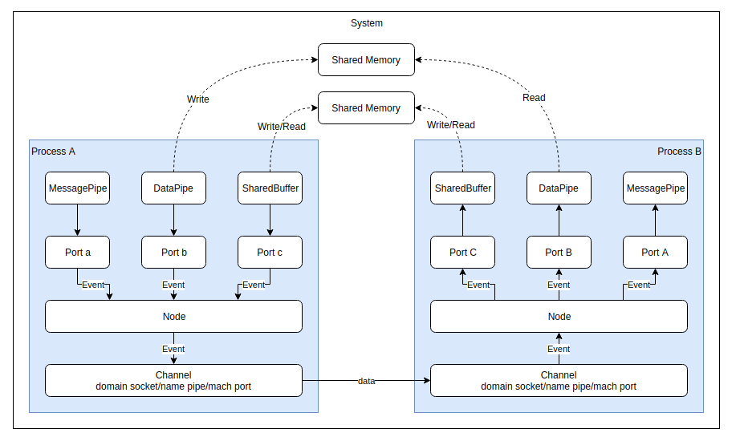

# Mojo

`Mojo` 是一个跨平台 IPC 框架，它诞生于 chromium ，用来实现 chromium 进程内/进程间的通信。目前，它也被用于 ChromeOS。

## Mojo 的分层


从图中看 Mojo 分4层:

1. `Mojo Core`: Mojo 的实现层，不能独立使用，由 C++ 实现；
2. `Mojo System API(C)`: Mojo 的 C API 层，它和 Mojo Core 对接，可以在程序中独立使用；
3. `Mojo System API(C++/Java/JS)`: Mojo 的各种语言包装层，它将 Mojo C API 包装成多种语言的库，让其他语言可以使用。这一层也可以在程序中独立使用；
4. `Mojo Bindings`: 这一层引入一种称为 `Mojom` 的 IDL（接口定义）语言，通过它可以定义通信接口，这些接口会生成接口类，使用户只要实现这些接口就可以使用 Mojo 进行通信，这一层使得IPC两端不需要通过原始字节流进行通信，而是通过接口进行通信，有点类似 Protobuf 和 Thrift 。

除了上面提到的那些层之外，在 Chromium 中还有2个模块对 Mojo 进行了包装，分别是 Services(//services) 模块和 IPC(//ipc) 模块。

1. `Services`: 一种更高层次的IPC机制，构建于Mojo之上，以`Service`的级别来进行IPC通信，Chromium大量使用这种IPC机制来包装各种服务，用来取代 `Legacy Chrome IPC`，比如device服务，preferences服务，audio服务，viz服务等。
2. `Legacy Chrome IPC`: 已经不推荐使用的Chrome IPC机制，提供 `IPC::Channel` 接口以及大量的使用宏来定义的 messages 类。目前它底层也是基于 Mojo 来实现的，但是上层接口和旧的 Chrome IPC 保持一致。chromium 中还有很多IPC使用这种方式，但是不应该在新的服务中使用这种机制。可以在[ipc/ipc_message_start.h](https://source.chromium.org/chromium/chromium/src/+/master:ipc/ipc_message_start.h;bpv=1;bpt=0)中察看还有哪些部分在使用这种IPC机制。

## Mojo Core 的设计

在使用 Mojo 之前，先来看一下 Mojo 的设计，这对理解后面的使用至关重要。

Mojo 支持在多个进程之间互相通信，这一点和其他的IPC有很大不同，其他大多只支持2个进程之间进行通信。由Mojo组成的这些可以互相通信的进程就形成了一个网络，在这个网络内的任意两个进程都可以进行通信，并且每个进程只能处于一个Mojo网络中，在这个网络内每一个进程内部有且只有一个`Node`,每一个`Node`可以提供多个`Port`，每个`Port`对应一种服务，这点类似TCP/IP中的IP地址和端口的关系。一个`Node:Port`对可以唯一确定一个服务。`Node`和`Node`之间通过`Channel`来实现通信，在不同平台上`Channel`有不同的实现方式，在Linux上是domain socket,在windows上是name pipe，在MAC OS平台上是 Mach Port。在Port之上，Mojo封装了3个“应用层协议”，分别为`MessagePipe`，`DataPipe`和`SharedBuffer`（类似在TCP上封装了HTTP，SMTP等）。整体结构如下图：



上图展示了在两个进程间使用Mojo的数据流。它有以下几个特点：

1. `Channel`: Mojo内部的实现细节，对外不可见，用于包装系统底层的通信通道，在Linux下是domain socket,Windows下是name pipe，MAC OS下是mach port；
2. `Node`: 每个进程只有一个Node，它在Mojo中的作用相当于TCP/IP中的IP地址，同样是内部实现细节，对外不可见；
3. `Port`: 每个进程可以有上百万个Port，它在Mojo中的作用相当于TCP/IP中的端口，同样是内部实现细节，对外不可见，每个Port都必定会对应一种应用层接口，目前Mojo支持三种应用层接口；
4. `MessagePipe`: 应用层接口，用于进程间的**双向**通信，底层使用Channel通道；
5. `DataPipe`: 应用层接口，用于进程间**单向**块数据传递，底层使用系统的Shared Memory实现；
6. `SharedBuffer`: 应用层接口，支持**双向**块数据传递，底层使用系统Shared Memory实现；
7. `MojoHandle`： 所有的 MessagePipe,DataPipe,SharedBuffer 都使用MojoHandle来包装，有了这个Hanle就可以对它们进行读写操作。还可以通过MessagePipe将MojoHandle发送到网络中的任意进程。
8. [`PlatformHanle`](https://source.chromium.org/chromium/chromium/src/+/master:mojo/public/cpp/platform/platform_handle.h;drc=b64eedb9d23e0350557a9bb22c9217ae52cd82c3;bpv=1;bpt=1;l=42): 用来包装系统的句柄或文件描述符，可以将它转换为MojoHandle然后发送到网络中的任意进程。

### Mojo 模糊了进程边界

需要特别说明的是，Mojo不是只能在不同进程间使用，它从一开始就考虑了在单进程中使用的场景，并且有专门的优化，因此，使用Mojo带来的一个额外好处是，在Mojo的一端进行读写不必知道另一端是运行在当前进程还是外部进程，这非常有利于将单进程程序逐步的使用Mojo拆分为多进程程序，并且可以在调试的时候使用单进程方便调试，在正式环境中使用多进程缩小程序崩溃时的影响范围。

## Mojo 的用法

可以使用不同层次的Mojo API来使用Mojo，下面我们一一介绍。

### 初始化 Mojo

初始化Mojo有两种方式，一种适用于静态链接Mojo的程序，一种适用于动态链接Mojo的程序。

以下是静态链接时的初始化方法：

```C++
int main(int argc, char** argv) {
  // 初始化CommandLine，DataPipe 依赖它
  base::CommandLine::Init(argc, argv);
  // 初始化 mojo
  mojo::core::Init();
  // 创建一个线程，用于Mojo内部收发数据
  base::Thread ipc_thread("ipc!");
  ipc_thread.StartWithOptions(
    base::Thread::Options(base::MessageLoop::TYPE_IO, 0));

  // 初始化 Mojo 的IPC支持，只有初始化后进程间的Mojo通信才能有效  
  // 这个对象要保证一直存活，否则IPC通信就会断开  
  mojo::core::ScopedIPCSupport ipc_support(
      ipc_thread.task_runner(),
      mojo::core::ScopedIPCSupport::ShutdownPolicy::CLEAN);

  // ...
}
```

### 使用 `Mojo C API`


### 使用 `Mojo C++ API`

### 使用 `Mojo C++ Bindings API`

### 使用 `Mojo Services`

一个[`Service`](https://source.chromium.org/chromium/chromium/src/+/master:services/service_manager/public/cpp/service.h)通过提供一个或多个Mojo接口来暴露一套服务，一个服务可以通过[`Connector`](https://source.chromium.org/chromium/chromium/src/+/master:services/service_manager/public/cpp/connector.h)来调用其他的服务，但并不是所有的服务之间都可以随意调用，而是通过[`Service Manager`](https://source.chromium.org/chromium/chromium/src/+/master:services/service_manager/service_manager.h)来管理多个 Service 间的依赖关系，只有明确表示有依赖关系的服务才能够被调用，而依赖关系则是通过[`Manifest`](https://source.chromium.org/chromium/chromium/src/+/master:services/service_manager/public/cpp/manifest.h)来定义的。这套机制的实现使用了 Mojom 接口，其中最重要的是 [service_manager](https://source.chromium.org/chromium/chromium/src/+/master:services/service_manager/public/mojom/service_manager.mojom), [service](https://source.chromium.org/chromium/chromium/src/+/master:services/service_manager/public/mojom/service.mojom), [connector](https://source.chromium.org/chromium/chromium/src/+/master:services/service_manager/public/mojom/connector.mojom)。

### 使用 `Legacy Chrome IPC`

--------------

参考文档：

* [Mojo docs (go/mojo-docs) - Mojo](https://chromium.googlesource.com/chromium/src/+/master/mojo/README.md)
* [Mojo docs (go/mojo-docs) - Mojo Basics](https://chromium.googlesource.com/chromium/src/+/master/mojo/docs/basics.md)
* [Mojo docs (go/mojo-docs) - Mojom Interface Definition Language (IDL)](https://chromium.googlesource.com/chromium/src/+/master/mojo/public/tools/bindings/README.md)
* [Mojo docs (go/mojo-docs) - Mojo C++ Bindings API](https://chromium.googlesource.com/chromium/src/+/master/mojo/public/cpp/bindings/README.md)
* [Mojo Style Guide](https://chromium.googlesource.com/chromium/src/+/master/docs/security/mojo.md)
* [Converting Legacy IPC to Mojo](https://chromium.googlesource.com/chromium/src/+/master/docs/mojo_ipc_conversion.md#Legacy-IPC-Concepts)
* [Intro to Mojo & Services](https://chromium.googlesource.com/chromium/src/+/master/docs/mojo_and_services.md)
* [Mojo & Servicification Performance Notes - Google Docs](https://docs.google.com/document/d/1n7qYjQ5iy8xAkQVMYGqjIy_AXu2_JJtMoAcOOupO_jQ/edit)
* [Mojo Bindings Conversion Cheatsheet - Google Docs](https://docs.google.com/document/d/1Jwfbzbe8ozaoilhqj5mAPYbYGpgZCen_XAAAdwmyP1E/edit#heading=h.serv9pzfw6sd)
* [Mojo & The Naming of Things - Google Docs](https://docs.google.com/document/d/18pOsJOTuLVH-V7s9xwR-em9t-R4icyPjk7i8I8bfjjg/edit#heading=h.d88n53n8beml)
* [Mojo Associated Interfaces - Google Docs](https://docs.google.com/document/d/1nq3J_HbS-gvVfIoEhcVyxm1uY-9G_7lhD-4Kyxb1WIY/edit)
* [Servicifying Chromium Features](https://chromium.googlesource.com/chromium/src/+/master/docs/servicification.md#Putting-It-All-Together)
* [core - Source](https://source.chromium.org/chromium/chromium/src/+/master:mojo/core/)
* [Is the "Intro to Mojo & Services" documentation up to date - Google Groups](https://groups.google.com/a/chromium.org/forum/#!topic/services-dev/fLtKFDY105o)
* [Super Simple Services - Google Docs](https://docs.google.com/document/d/1M0-K0gi1xXO0f_-YKSH2LFVh4RJY-xe9T9VaGFOSXb0/edit#)
