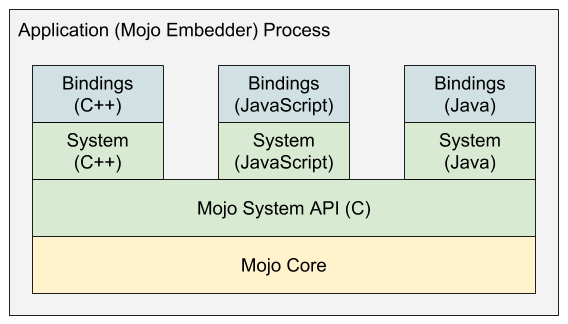
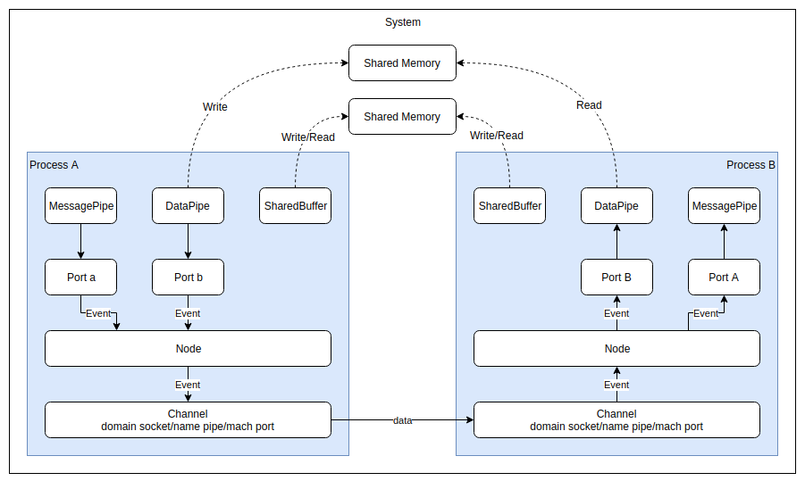
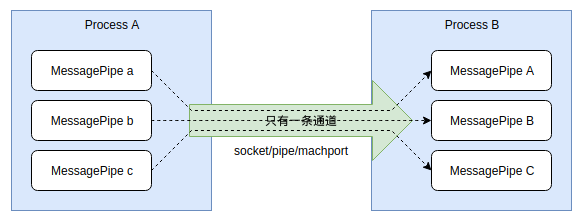
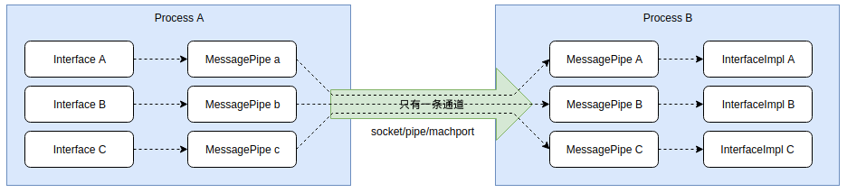
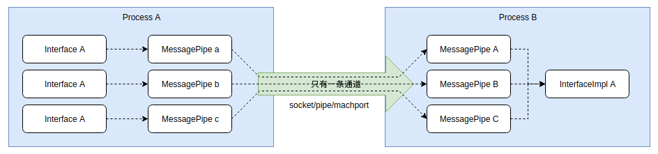
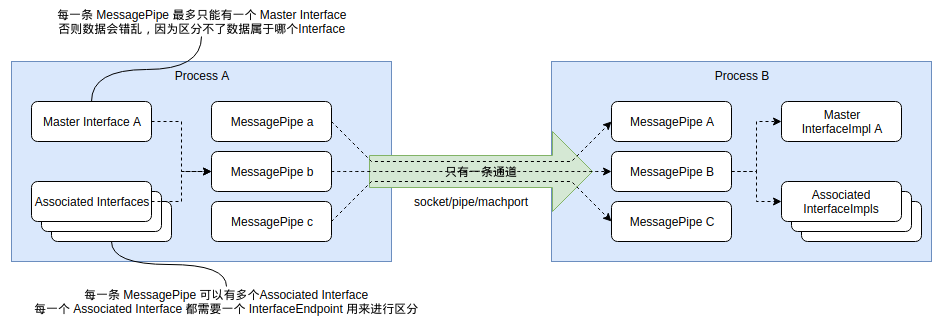
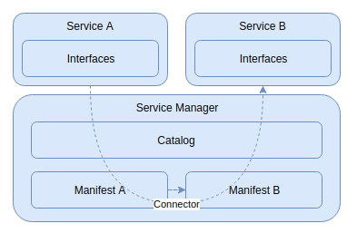
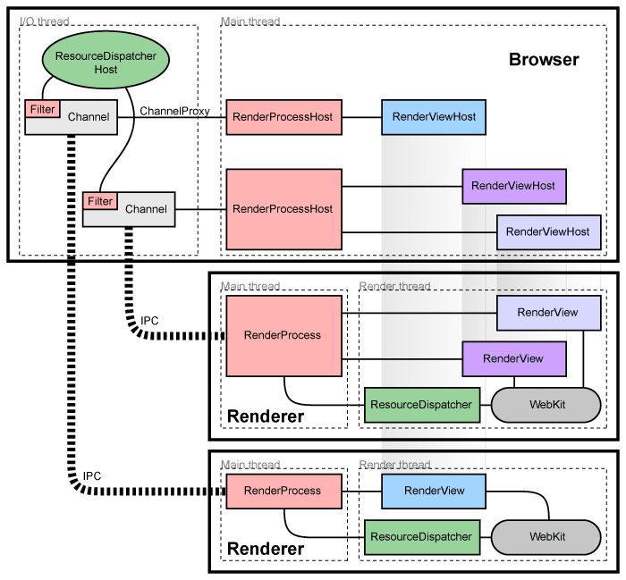

# Mojo

`Mojo` 是一个跨平台 IPC 框架，它诞生于 chromium ，用来实现 chromium 进程内/进程间的通信。目前，它也被用于 ChromeOS。

## 一、Mojo 的分层



从图中看 Mojo 分4层:

1. `Mojo Core`: Mojo 的实现层，不能独立使用，由 C++ 实现；
2. `Mojo System API(C)`: Mojo 的 C API 层，它和 Mojo Core 对接，可以在程序中独立使用；
3. `Mojo System API(C++/Java/JS)`: Mojo 的各种语言包装层，它将 Mojo C API 包装成多种语言的库，让其他语言可以使用。这一层也可以在程序中独立使用；
4. `Mojo Bindings`: 这一层引入一种称为 `Mojom` 的 IDL（接口定义）语言，通过它可以定义通信接口，这些接口会生成接口类，使用户只要实现这些接口就可以使用 Mojo 进行通信，这一层使得IPC两端不需要通过原始字节流进行通信，而是通过接口进行通信，有点类似 Protobuf 和 Thrift 。

除了上面提到的那些层之外，在 Chromium 中还有2个模块对 Mojo 进行了包装，分别是 Services(//services) 模块和 IPC(//ipc) 模块。

1. `Services`: 一种更高层次的IPC机制，构建于Mojo之上，以`Service`的级别来进行IPC通信，Chromium大量使用这种IPC机制来包装各种服务，用来取代 `Legacy Chrome IPC`，比如device服务，preferences服务，audio服务，viz服务等。
2. `Legacy Chrome IPC`: 已经不推荐使用的Chrome IPC机制，提供 `IPC::Channel` 接口以及大量的使用宏来定义的 messages 类。目前它底层也是基于 Mojo 来实现的，但是上层接口和旧的 Chrome IPC 保持一致。chromium 中还有很多IPC使用这种方式，但是不应该在新的服务中使用这种机制。可以在[ipc/ipc_message_start.h](https://source.chromium.org/chromium/chromium/src/+/master:ipc/ipc_message_start.h;bpv=1;bpt=0)中查看还有哪些部分在使用这种IPC机制。

## 二、Mojo 的设计

在使用 Mojo 之前，先来看一下 Mojo 的设计，这对理解后面的使用至关重要。

Mojo 支持在**多个**进程之间互相通信，这一点和其他的IPC有很大不同，其他大多只支持2个进程之间进行通信。由Mojo组成的这些可以互相通信的进程就形成了一个网络，在这个网络内的任意两个进程都可以进行通信，并且每个进程只能处于一个Mojo网络中，在这个网络内每一个进程内部有且只有一个`Node`,每一个`Node`可以提供多个`Port`，每个`Port`对应一种服务，这点类似TCP/IP中的IP地址和端口的关系。一个`Node:Port`对可以唯一确定一个服务。`Node`和`Node`之间通过`Channel`来实现通信，在不同平台上`Channel`有不同的实现方式，在Linux上是domain socket,在windows上是name pipe，在MAC OS平台上是 Mach Port。在Port上一层，Mojo封装了3个“应用层协议”，分别为`MessagePipe`，`DataPipe`和`SharedBuffer`（类似在TCP上封装了HTTP，SMTP等）。整体结构如下图：



上图展示了在两个进程间使用Mojo的数据流。它有以下几个特点：

1. `Channel`: Mojo内部的实现细节，对外不可见，用于包装系统底层的通信通道，在Linux下是domain socket,Windows下是name pipe，MAC OS下是mach port；
2. `Node`: 每个进程只有一个Node，它在Mojo中的作用相当于TCP/IP中的IP地址，同样是内部实现细节，对外不可见；
3. `Port`: 每个进程可以有上百万个Port，它在Mojo中的作用相当于TCP/IP中的端口，同样是内部实现细节，对外不可见，每个Port都必定会对应一种应用层接口，目前Mojo支持三种应用层接口；
4. `MessagePipe`: 应用层接口，用于进程间的**双向**通信，类似UDP,消息是基于数据报的，底层使用Channel通道；
5. `DataPipe`: 应用层接口，用于进程间**单向**块数据传递，类似TCP,消息是基于数据流的，底层使用系统的Shared Memory实现；
6. `SharedBuffer`: 应用层接口，支持**双向**块数据传递，底层使用系统Shared Memory实现；
7. `MojoHandle`： 所有的 MessagePipe,DataPipe,SharedBuffer 都使用MojoHandle来包装，有了这个Hanle就可以对它们进行读写操作。还可以通过MessagePipe将MojoHandle发送到网络中的任意进程。
8. [`PlatformHanle`](https://source.chromium.org/chromium/chromium/src/+/master:mojo/public/cpp/platform/platform_handle.h;drc=b64eedb9d23e0350557a9bb22c9217ae52cd82c3;bpv=1;bpt=1;l=42): 用来包装系统的句柄或文件描述符，可以将它转换为MojoHandle然后发送到网络中的任意进程。

### MessagePipe

一个进程中可以有N多个MessagePipe，所有的MessagePipe都共享底层的一条通信通道，就像下图这样：



**Mojo保证同一个MessagePipe中数据的发送顺序和接收顺序一致，但是不保证多个MessagePipe之间的数据的有序。**

### Mojo 模糊了进程边界

需要特别说明的是，Mojo不是只能在不同进程间使用，它从一开始就考虑了在单进程中使用的场景，并且有专门的优化，因此，使用Mojo带来的一个额外好处是，在Mojo的一端进行读写不必知道另一端是运行在当前进程还是外部进程，这非常有利于将单进程程序逐步的使用Mojo拆分为多进程程序，并且可以在调试的时候使用单进程方便调试，在正式环境中使用多进程缩小程序崩溃时的影响范围。

## 三、Mojo 的应用

Mojo 不仅可以在 Chromium 中使用，也可以在任何第三方程序中使用，因为它本身不依赖于 Chromium 中的业务逻辑部分。不过由于它的源码在 Chromium 中，在其他程序中使用可能没有那么方便。

Mojo提供了不同层次的API，外部可以根据自己的需要选择使用的层次，下面我们简单介绍每种API的使用方法，详细信息可以查看对应的demo程序。

> 目前 Mojo 支持 C++/Java/Js，这里只介绍C++相关用法。

### 初始化 Mojo

初始化Mojo有两种方式，一种适用于静态链接Mojo的程序，一种适用于动态链接Mojo的程序。以下是静态链接时的初始化方法，动态链接时只需要把`mojo::core::Init()`替换为`MojoInitialize()`即可。

初始化接口的头文件为:

```C++
#include <mojo/core/embedder/embedder.h>
#include <mojo/core/embedder/scoped_ipc_support.h>
```

初始化方法如下:

```C++
int main(int argc, char** argv) {
  // 初始化CommandLine，DataPipe 依赖它
  base::CommandLine::Init(argc, argv);
  // 初始化 mojo
  mojo::core::Init();
  // 创建一个线程，用于Mojo内部收发数据
  base::Thread ipc_thread("ipc!");
  ipc_thread.StartWithOptions(
    base::Thread::Options(base::MessageLoop::TYPE_IO, 0));

  // 初始化 Mojo 的IPC支持，只有初始化后进程间的Mojo通信才能有效  
  // 这个对象要保证一直存活，否则IPC通信就会断开  
  mojo::core::ScopedIPCSupport ipc_support(
      ipc_thread.task_runner(),
      mojo::core::ScopedIPCSupport::ShutdownPolicy::CLEAN);

  // ...
}
```

### `Mojo C API`

Mojo C API 都比较简单，主要的头文件位于:

```C++
// SharedBuffer API
#include "mojo/public/c/system/buffer.h"
// DataPipe API
#include "mojo/public/c/system/data_pipe.h"
// MessagePipe API
#include "mojo/public/c/system/message_pipe.h"
```

以下是在单进程中使用 MessagePipe 发送和接收数据的方法:

```C++
// 使用 C 接口创建一条MessagePipe
// MessagePipe 只是一对数字，只用于ID标识，并不对应任何系统资源
// 因此可以非常快速，不可能失败的，创建大量的MessagePipe。
MojoHandle sender_handle, receiver_handle;
MojoResult result =
    MojoCreateMessagePipe(NULL, &sender_handle, &receiver_handle);
DCHECK_EQ(result, MOJO_RESULT_OK);
// 使用 C 接口发送一条消息
{
  // 创建一条 Message
  MojoMessageHandle message;
  result = MojoCreateMessage(nullptr, &message);
  DCHECK_EQ(result, MOJO_RESULT_OK);
  MojoAppendMessageDataOptions options;
  options.struct_size = sizeof(options);
  // 这个选项表示这条消息完整了，底层可以发送了
  options.flags = MOJO_APPEND_MESSAGE_DATA_FLAG_COMMIT_SIZE;
  void* buffer;
  uint32_t buffer_size;
  // 给 Message 填充数据
  result = MojoAppendMessageData(message, 6, nullptr, 0, &options, &buffer,&buffer_size);
  DCHECK_EQ(result, MOJO_RESULT_OK);
  memcpy(buffer, "hello", 6);
  LOG(INFO) << "send: " << (const char*)buffer;
  // 发送 Message
  result = MojoWriteMessage(sender_handle, message, nullptr);
  DCHECK_EQ(result, MOJO_RESULT_OK);
}
// 使用 C 接口接收一条消息
{
  MojoMessageHandle message;
  MojoResult result = MojoReadMessage(receiver_handle, nullptr, &message);
  DCHECK_EQ(result, MOJO_RESULT_OK);

  void* buffer = NULL;
  uint32_t num_bytes;
  result = MojoGetMessageData(message, nullptr, &buffer, &num_bytes, nullptr,nullptr);
  LOG(INFO) << "receive: " << (const char*)buffer;
}
```

其他关于 `DataPipe` 和 `SharedBuffer` 的使用方法都类似，由于实际项目中很少直接使用 C API，所以其使用方法在这里省略了。

demo 见 [demo_mojo_single_process.cc](../demo_mojo_single_process.cc) .

### `Mojo C++ API`

#### 单进程

以下是在单进程中使用 MessagePipe 的方法，其中最重要的是要注意 `mojo::MessagePipe pipe;` 这一行（内部调用Mojo的C API `MojoCreateMessagePipe`），它创建了一个MessagePipe，本质上只是创建了一对随机数，对应pipe中的两个属性`handle0`和`handle1`,这两个功能上没有任何区别，向其中的一个handle写的数据可以从另一个handle中读取出来。

```C++
#include "mojo/public/cpp/system/buffer.h"
#include "mojo/public/cpp/system/data_pipe.h"
#include "mojo/public/cpp/system/message_pipe.h"
#include "mojo/public/cpp/system/simple_watcher.h"
#include "mojo/public/cpp/system/wait.h"

// 使用C++接口创建一条 MessagePipe
mojo::MessagePipe pipe;
// 使用 C++ 接口发送一条消息
{
  const char kMessage[] = "HELLO";
  result =
      mojo::WriteMessageRaw(pipe.handle0.get(), kMessage, sizeof(kMessage),
                            nullptr, 0, MOJO_WRITE_MESSAGE_FLAG_NONE);
  DCHECK_EQ(result, MOJO_RESULT_OK);
  LOG(INFO) << "send: " << kMessage;
}
// 使用 C++ 接口接收一条消息
{
  std::vector<uint8_t> data;
  result = mojo::ReadMessageRaw(pipe.handle1.get(), &data, nullptr,
                                MOJO_READ_MESSAGE_FLAG_NONE);
  DCHECK_EQ(result, MOJO_RESULT_OK);
  LOG(INFO) << "receive msg: " << (char*)&data[0];
}
```

关于DataPipe和SharedBuffer的使用这里不再赘述，详见 [demo_mojo_single_process.cc](../demo_mojo_single_process.cc)。

#### 多进程

一个MessagePipe中有一对handle，分别是handle0和handle1,向其中一个handle写的数据可以从另外一个handle读出来，这是前面已经说过的，如果把其中的一个handle发送到另外一个进程，这一对handle之间依然能够相互收发数据。Mojo提供了多种方法来发送handle到其他的进程，其中最简单的是使用 [Invitation](https://source.chromium.org/chromium/chromium/src/+/master:mojo/public/cpp/system/invitation.h)。

要在多个进程间使用Mojo，必须先通过Invitation将这些进程“连接”起来，这需要一个进程发送Invitation,另一个进程接收Invitation,发送Invitation的方法如下：

```C++
// 创建一条系统级的IPC通信通道
// 在linux上是 domain socket, Windows 是 named pipe，MacOS是Mach Port,该通道用于支持夸进程的消息通信
mojo::PlatformChannel channel;
LOG(INFO) << "local: "
          << channel.local_endpoint().platform_handle().GetFD().get()
          << " remote: "
          << channel.remote_endpoint().platform_handle().GetFD().get();

mojo::OutgoingInvitation invitation;
// 创建1个Ｍessage Pipe用来和其他进程通信
// 这里的 pipe 就相当于单进程中的pipe.handle0
// handle1 会被存储在invitation中，随后被发送出去
// 可以多次调用，以便Attach多个MessagePipe到Invitation中
mojo::ScopedMessagePipeHandle pipe =
    invitation.AttachMessagePipe("my raw pipe");
LOG(INFO) << "pipe: " << pipe->value();

base::LaunchOptions options;
base::CommandLine command_line(
    base::CommandLine::ForCurrentProcess()->GetProgram());
// 将PlatformChannel中的RemoteEndpoint的fd作为参数传递给子进程
// 在posix中，fd会被复制到新的随机的fd，fd号改变
// 在windows中，fd被复制后会直接进行传递，fd号不变
channel.PrepareToPassRemoteEndpoint(&options, &command_line);
// 启动新进程
base::Process child_process = base::LaunchProcess(command_line, options);
channel.RemoteProcessLaunchAttempted();

// 发送Invitation
mojo::OutgoingInvitation::Send(
    std::move(invitation), child_process.Handle(),
    channel.TakeLocalEndpoint(),
    base::BindRepeating(
        [](const std::string& error) { LOG(ERROR) << error; }));
```

在新进程中接收Invitation的方法如下：

```C++
// Accept an invitation.
mojo::IncomingInvitation invitation = mojo::IncomingInvitation::Accept(
    mojo::PlatformChannel::RecoverPassedEndpointFromCommandLine(
        *base::CommandLine::ForCurrentProcess()));
// 取出 Invitation 中的pipe
mojo::ScopedMessagePipeHandle pipe =
    invitation.ExtractMessagePipe("my raw pipe");
LOG(INFO) << "pipe: " << pipe->value();
```

这样就实现了将pipe中的一个handle发送到其他进程了，这两个进程可以开始使用pipe进行收发数据了。

以上只是将handle从一个进程发送到另一个进程的一种方法，这种方法一般用在新进程创建的时候，如果两个进程已经通过Invitation连接起来了，那么可以通过已经建立起来的MessagePipe来发送新的MessagePipe的handle到接收进程，发送端的代码如下：

```C++
const std::string kMessage("MessagePipe\0", 12);
mojo::ScopedMessagePipeHandle client;
mojo::ScopedMessagePipeHandle server;
// 创建一个新的MessagePipe（的一对handle）
// 也可以使用 mojo::MessagePipe 来创建，这两者是一样的
result = mojo::CreateMessagePipe(nullptr, &client, &server);
DCHECK_EQ(result, MOJO_RESULT_OK);

// 使用已经连接起来的pipe将 'client' 发送到对方
result = mojo::WriteMessageRaw(pipe.get(), kMessage.c_str(),
                                kMessage.length(), &client->value(), 1,
                                MOJO_WRITE_MESSAGE_FLAG_NONE);
DCHECK_EQ(result, MOJO_RESULT_OK);
// 后面就可以使用servier来和对端通信了
```

接收端的代码如下：

```C++
std::vector<uint8_t> data;
// 用来存储接收到的handle
std::vector<mojo::ScopedHandle> handles;
result = mojo::ReadMessageRaw(pipe.get(), &data, &handles,
                              MOJO_READ_MESSAGE_FLAG_NONE);
DCHECK_EQ(result, MOJO_RESULT_OK);

// 将接收到的handle转换为MessagePipeHandle
// 后续就可以使用这个handle和对端通信了
mojo::ScopedMessagePipeHandle client =
    mojo::ScopedMessagePipeHandle::From(std::move(handles[0]));
```

以上演示了使用已经建立起来的pipe来发送新的MessageaPipe的handle到其他进程的方法，其实这个handle不仅可以是MessagePipe的handle，也可以是DataPipe或者SharedBuffer或者是系统中的其他handle，比如socket fd，窗口句柄等。Mojo提供了 [PlatformHandle](https://source.chromium.org/chromium/chromium/src/+/master:mojo/public/cpp/platform/platform_handle.h) 类来包装这些Native的handle，以便这些handle可以使用MessagePipe进行发送。Mojo内部会使用所在系统的相应API来实现handle的复制和发送（在Linux上是[sendmsg](https://linux.die.net/man/2/sendmsg)，在windows上是[DuplicateHandle](https://docs.microsoft.com/en-us/windows/win32/api/handleapi/nf-handleapi-duplicatehandle)）。

demo 见 [demo_mojo_multiple_process.cc](../demo_mojo_multiple_process.cc) 。

### `Mojo C++ Bindings API`

Bindings API 是使用 Mojo 的重点，在项目中会大量使用。

#### Mojom

Mojo在Binding层中引入了 [`Mojom`](https://chromium.googlesource.com/chromium/src/+/master/mojo/public/tools/bindings/README.md) 这种IDL语言，用它来定义接口。接口定义文件的后缀一般为 `.mojom`，一个简单的接口定义如下：

```C++
// mojom/test.mojom

// 定义接口所属的"module"，在生成的C++代码中对应到命名空间
module demo.mojom;

// 定义一个接口，在C++中对应一个抽象类
interface Test {
  // 定义一个Hello方法，该方法没有返回值
  Hello(string who);
  // 定义一个Hi方法，返回值为string类型
  // 返回值会对应到C++中的回调方法
  Hi() => (string who);
};
```

定义好mojom文件后，需要在合适的BUILD.gn文件中添加一下代码，以便在编译时将mojom文件生成源代码文件：

```python
# for mojo
import("//mojo/public/tools/bindings/mojom.gni")

mojom("mojom_test") {
  sources = [
    "mojom/test.mojom",
  ]
}
```

这样定义之后，就可以在其他地方依赖`mojom_test`这个target了。

生成的代码类似下面这样：

```C++
// out/Default/gen/demo/mojom/test.mojom.h

namespace demo {
namespace mojom {
class Test;
// 注意这些重命名，在71版本中大量使用，需要熟悉
// 记住 xxxPtr,xxxPtrInfo,xxxRequest
// 这些命名在最新的版本中已经被改了
using TestPtr = mojo::InterfacePtr<Test>;
using TestPtrInfo = mojo::InterfacePtrInfo<Test>;
using TestRequest = mojo::InterfaceRequest<Test>;
...
// 相应的Associated版本
using TestAssociatedPtr =
    mojo::AssociatedInterfacePtr<Test>;
using TestAssociatedPtrInfo =
    mojo::AssociatedInterfacePtrInfo<Test>;
using TestAssociatedRequest =
    mojo::AssociatedInterfaceRequest<Test>;


class TestProxy;

template <typename ImplRefTraits>
class TestStub;

class TestRequestValidator;
class TestResponseValidator;

// 这个就是生成的接口类了
class  Test
    : public TestInterfaceBase {
 public:
  static const char Name_[];
  static constexpr uint32_t Version_ = 0;
  static constexpr bool PassesAssociatedKinds_ = false;
  static constexpr bool HasSyncMethods_ = false;

  using Proxy_ = TestProxy;

  template <typename ImplRefTraits>
  using Stub_ = TestStub<ImplRefTraits>;

  using RequestValidator_ = TestRequestValidator;
  using ResponseValidator_ = TestResponseValidator;
  enum MethodMinVersions : uint32_t {
    kHelloMinVersion = 0,
    kHiMinVersion = 0,
  };
  virtual ~Test() {}

  // Hello 方法
  virtual void Hello(const std::string& who) = 0;

  // Hi 方法，返回值是回调形式
  using HiCallback = base::OnceCallback<void(const std::string&)>;
  virtual void Hi(HiCallback callback) = 0;
};
...
} // namespace mojom
} // namespace demo
```

#### Bindings

可以看到`Hello`方法和`Hi`方法都是纯虚函数，需要自己实现具体的功能，我们简单实现一下这个Test接口：

```C++
class TestImpl : public demo::mojom::Test {
 public:
  void Hello(const std::string& who) override {
    who_ = who;
    LOG(INFO) << "Test1 run: Hello " << who_;
  }

  void Hi(HiCallback callback) override {
    LOG(INFO) << "Test1 run: Hi " << who_;
    std::move(callback).Run(who_);
  }

 private:
  std::string who_;
};
```

可以看到，实现一个Mojo接口类和实现一个普通的C++接口并没有什么区别，接下来就是使用这个类了。

Mojo接口的使用是依赖MessagePipe的，我们知道一个MessagePipe有一对handle，这一对handle套到接口类中就是一个handle对应Test接口，一个handle对应Test的实现（的一个实例）。MessagePipe和Interface的关系如下图：



要使用一个接口必须有一个MessagePipe，我们可以创建一个MessagePipe，就像下面这样：

```C++
// 这些是mojo生成的，放到这里方面理解
using TestPtr = mojo::InterfacePtr<Test>;
using TestPtrInfo = mojo::InterfacePtrInfo<Test>;
using TestRequest = mojo::InterfaceRequest<Test>;

// 创建一个MessagePipe
mojo::MessagePipe pipe;
// 创建 TestPtr，TestPtr见mojo生成的代码
// 把 pipe 的handle0传给了TestPtr
// 下面的写法也可以分两步写：
// demo::mojom::TestPtr test；
// test.Bind(...)
demo::mojom::TestPtr test(demo::mojom::TestPtrInfo(std::move(pipe.handle0),0));
// 接下来就可以调用Test接口提供的方法了
// 这些调用会被序列化后使用handle0发送出去
test->Hello("World!");
test->Hi(base::BindOnce([](const std::string& who) {
          LOG(INFO) << "Test1 response: Hi " << who;
        }));

// 使用一个Test接口的实例和pipe的handle1构造一个Binding对象
// 上面的Hello和Hi的调用会被mojo转发到这个对象中
// 这些代码可以放在接口调用之后进行，因为mojo会缓存之前的调用
// 只要TestImpl对象和Binding对象不被销毁，对Test接口的调用就会正常进行
TestImpl test_impl;
mojo::Binding<demo::mojom::Test> test(&test_impl,
  demo::mojom::TestRequest(std::move(pipe.handle1)));
```

以上是在单进程中使用Mojo接口的方法，如果把handle1发送到其他进程，则可以实现夸进程调用远程接口了。

在实际使用中，经常把Binding对象放到接口的实现类中，像下面这样：

```C++
class TestImpl : public demo::mojom::Test {
 public:
  TestImpl(demo::mojom::TestRequest request)
    : binding_(this,std::move(request)) {

  void Hello(const std::string& who) override {
    who_ = who;
    LOG(INFO) << "Test1 run: Hello " << who_;
  }

  void Hi(HiCallback callback) override {
    LOG(INFO) << "Test1 run: Hi " << who_;
    std::move(callback).Run(who_);
  }

 private:
  std::string who_;
  mojo::Binding<demo::mojom::Test> binding_;
};
```

在使用的时候就可以比较简单的使用：

```C++
auto TestImpl = new TestImpl(demo::mojom::TestRequest(std::move(pipe.handle1)))
```

只要保证这个对象不被销毁，则接口都可以正常调用。

Mojo接口的参数不仅可以是简单类型，也可以是handle类型的，也就是说可以使用Mojo接口来传递MojoHandle，这在demo中有演示，详见 [demo_mojo_multiple_process_binding.cc](../demo_mojo_multiple_process_binding.cc) 。

#### mojo::BindingSet

以上是Binding的基本使用，一个接口的调用实际需要有一个MessagePipe支撑，那如果我想在多个地方调用同一个接口怎么办呢？

根据接口是否有状态（也就是对接口的调用会改变接口的实现对象，Test接口就是有状态的，因为Hello的调用会更新`who_`属性）有不同的方法：

- 接口有状态： 每次需要调用的时候都重新走一遍以上流程；
- 接口无状态： 让TestPtr全局可访问，所有对Test接口的调用都使用同一个TestPtr对象，或者使用mojo::BindingSet，它允许一个TestImpl实例接收来自多个TestPtr的调用。

mojo::BindingSet 的使用非常简单，只要把mojo::Binding替换为mojo::BindingSet，需要Binding的时候调用BindingSet的AddBinding方法即可。

使用BindingSet时接口和MessagePipe的关系如下，可以看到接收端只需要一个接口实例即可服务于多个接口调用。



#### Associated Interface

每一个 Binding 层中的接口（的实例）都唯一对应一个 MessagePipe，不能在同一个MessagePipe中使用两个接口，如果必须要在同一个MessagePipe中使用多个接口（因为这样可以保证顺序），则需要使用Associated Interface，这种关联接口可以用于多个接口之间有调用顺序依赖的情况，它和普通的Interface的关系如下：



这里的MasterInterface就是前文所述的接口，可以看到Master Interface和多个Associated Interfaces共用一个MessagePipe。

要使用关联接口需要修改接口可以使用在定义接口时使用`associated`关键字：

```C++
// mojom/test3.mojom

interface Api {
    PrintApi(string data);
};

interface Api2 {
    PrintApi2(string data);
};

// Test3 依赖 Api 和 Api2 接口，不使用关联接口
interface Test3 {
    GetApi(Api& api);
    SetApi2(Api2 api2);
};

// Test3 依赖 Api 和 Api2 接口，使用关联接口
interface Test32 {
    GetApi(associated Api& api);
    SetApi2(associated Api2 api2);
};
```

具体的使用方法这里不再赘述了，详见 [demo_mojo_multiple_process_binding.cc](../demo_mojo_multiple_process_binding.cc) 。

#### `mojo::MakeRequest`

`mojo::MakeRequest()`可以简化MessagePipe的创建，只是一个非常简单的包装而已：

```C++
// 创建新的MessagePipe用于Api接口的调用
mojo::MessagePipe api_pipe;
Remote<Api> api(PendingRemote<Api>(std::move(api_pipe.handle0),0));
test3->GetApi(PendingReceiver<Api>(std::move(api_pipe.handle1)));
//以上代码可以简化为：
Remote<Api> api;
test3->GetApi(mojo::MakeRequest(&api));
// 使用MakeRequest结果和上面一样，可以更简单,在更新的版本中Remote中添加了BindNew*方法，用来取代MakeRequest
```

#### 新版本改动

在Chromium的新版本中，所有的xxxPtr，xxxPtrInfo等类都进行了改名，简单来讲新旧版本的类名的对应关系如下：

```C++
// 在新版本中这些类被重命名,这里模拟新版本
template<class T> using Remote = mojo::InterfacePtr<T>;
template<class T> using PendingRemote = mojo::InterfacePtrInfo<T>;
template<class T> using Receiver = mojo::Binding<T>;
template<class T> using PendingReceiver = mojo::InterfaceRequest<T>;

// 以下定义用于模拟新版本的关联接口
template<class T> using AssociatedRemote = mojo::AssociatedInterfacePtr<T>;
template<class T> using PendingAssociatedRemote = mojo::AssociatedInterfacePtrInfo<T>;
template<class T> using AssociatedReceiver = mojo::AssociatedBinding<T>;
template<class T> using PendingAssociatedReceiver = mojo::AssociatedInterfaceRequest<T>;
```

还有一些改动这里不再赘述，具体可以查看 [Mojo & The Naming of Things - Google Docs](https://docs.google.com/document/d/18pOsJOTuLVH-V7s9xwR-em9t-R4icyPjk7i8I8bfjjg/edit#heading=h.d88n53n8beml)。

### `Mojo Services`

一个[`Service`](https://source.chromium.org/chromium/chromium/src/+/master:services/service_manager/public/cpp/service.h)通过提供一个或**多个**Mojo接口来暴露一套服务，一个服务可以通过[`Connector`](https://source.chromium.org/chromium/chromium/src/+/master:services/service_manager/public/cpp/connector.h)来调用其他的服务，但并不是所有的服务之间都可以随意调用，而是通过[`Service Manager`](https://source.chromium.org/chromium/chromium/src/+/master:services/service_manager/service_manager.h)来管理多个 Service 间的依赖关系，只有明确表示有依赖关系的服务才能够被调用，而依赖关系则是通过[`Manifest`](https://source.chromium.org/chromium/chromium/src/+/master:services/service_manager/public/cpp/manifest.h)来定义的，所有的这些Manifest组合在一起称为一个[`Catalog`](https://source.chromium.org/chromium/chromium/src/+/71.0.3578.0:services/catalog/catalog.h)。
这套机制的实现使用 Mojom 定义接口，其中最重要的是 [service_manager](https://source.chromium.org/chromium/chromium/src/+/master:services/service_manager/public/mojom/service_manager.mojom), [service](https://source.chromium.org/chromium/chromium/src/+/master:services/service_manager/public/mojom/service.mojom), [connector](https://source.chromium.org/chromium/chromium/src/+/master:services/service_manager/public/mojom/connector.mojom)。

下图展示了Service A 和 Service B通过定义Manifest依赖，使用Connector相互调用的示意图：



当Service A要调用Serivce B提供的接口的时候，通过自己的Connector对象向ServiceManager发起接口Binding请求，Service Manager会收到这个请求，然后根据已经注册的Manifest依赖关系，验证Service A是否声明了对Service B的依赖，如果是，则Service Manager会检查Service B是否已经存在，如果已经存在，则使用Serivce B，否则启动一个新的Service B实例，这个实例可能运行在一个独立的进程中，这样Service A就获得了由Service B提供的一个Mojo接口。

需要注意的是，Services是多进程架构，以上的Service A，Service B以及Service Mananger 都可以运行在独立的进程中。Service Manager 所在的进程称为 Borker 进程。为了方便用户使用该多进程架构，Services模块提供了一套创建新的可执行程序的框架，目前 Chromium 的启动就使用了该框架，该框架内部会进行一些常用功能的初始化，比如日志，崩溃时的handler，CommandLine，mojo，Tracker/Trace,LANG等，其中最重要的是process_type，默认情况下进程是Embedder类型的，在Chromium中只使用了这个类型。详细信息可以查看 [services/service_manager/embedder/main.cc](https://source.chromium.org/chromium/chromium/src/+/master:services/service_manager/embedder/main.cc)。

#### service_manager::Main()

`service_manager::Main()`可以帮助我们初始化很多有用的模块，使用方法如下：

```C++
#include "base/at_exit.h"

// For services
#include "services/service_manager/embedder/main.h"
#include "services/service_manager/embedder/main_delegate.h"

// 需要先实现一个MainDelegate
class DemoServerManagerMainDelegate : public service_manager::MainDelegate {
 public:
  DemoServerManagerMainDelegate() {}
  // 默认情况下ServiceManager最终会调到这里，将控制权交给用户自己的代码
  int RunEmbedderProcess() override {
    // 自定义进程的行为
    ...
  }
};

int main(int argc, const char** argv) {
  // process_type 为 Service 的进程不会初始化这个
  // 应该是Chromium的bug,因为Chromium中没有使用Service类型的进程
  base::AtExitManager at_exit;
  DemoServerManagerMainDelegate delegate;
  service_manager::MainParams main_params(&delegate);
  main_params.argc = argc;
  main_params.argv = argv;
  return service_manager::Main(main_params);
}
```

> 注意： 要是用Services，并不是一定非要使用以上的启动逻辑，只是以上启动逻辑会帮忙初始化很多有用的模块，用起来比较简单罢了。

#### 创建一个Service

Service一般都要提供一些能力`Capacity`给其他Service使用，这些Capacity是以Mojo接口的形式提供的，因此，要创建Service，需要先定义Mojo接口：

定义一个TestInterface接口：

```C++
module demo.mojom;

interface TestInterface {
    Hello(string who);
};
```

实现该接口：

```C++
// 在新版本中这些类被重命名,这里模拟新版本
template <class T>
using Remote = mojo::InterfacePtr<T>;
template <class T>
using PendingRemote = mojo::InterfacePtrInfo<T>;
template <class T>
using Receiver = mojo::Binding<T>;
template <class T>
using PendingReceiver = mojo::InterfaceRequest<T>;

class TestInterfaceImpl : public demo::mojom::TestInterface {
 public:
  TestInterfaceImpl(PendingReceiver<TestInterface> receiver)
      : receiver_(this, std::move(receiver)) {}

  void Hello(const std::string& who) {
    LOG(INFO) << "TestInterfaceImpl run: Hello " << who;
  }

 private:
  Receiver<demo::mojom::TestInterface> receiver_;
};
```

实现一个Service:

```C++
// 这里故意把Service的实现和接口的实现分开,方便演示
class TestService : public service_manager::Service {
 public:
  void OnStart() override {
    LOG(INFO) << "TestService Start.";
    // 演示从一个服务内请求其它服务提供的接口
    Remote<RootInterface> root;
    context()->connector()->BindInterface("consumer_service",
      mojo::MakeRequest(&root));
    root->Hi("TestService");
  }
  // 当其他服务调用connector->Connect()时会触发这里
  void OnBindInterface(const service_manager::BindSourceInfo& source,
                       const std::string& interface_name,
                       mojo::ScopedMessagePipeHandle interface_pipe) override {
    LOG(INFO) << "OnBindInterface: " << interface_name;
    // 这里可以使用BinderRegistry来简化
    if (interface_name == TestInterface::Name_) {
      test_interface_.reset(new TestInterfaceImpl(
          PendingReceiver<TestInterface>(std::move(interface_pipe))));
    }
  }

 private:
  std::unique_ptr<TestInterfaceImpl> test_interface_;
};
```

Servcie 要定义自己的Manifest来描述自己提供的能力以及以来的其他Servcies，Manifest由一个json文件描述：

```json
// mojom/test_servcie_manifest.json
{
    "name": "test_service",
    "display_name": "Test Service",
    "interface_provider_specs": {
        "service_manager:connector": {
            "provides": {
                "test": ["demo.mojom.TestInterface"]
            },
            "requires": {
                "consumer_service":["root"]
            }
        }
    }
}
```

这里可以看到，我们的服务名字为`test_servcie`，它通过`demo.mojom.TestInterface`提供了`test`能力，并且依赖`consumer_service`服务的`root`能力。

接下里需要在BUILD.gn文件中，将该json定义的Manifest生成代码可访问的Catalog，在BUILD.gn中添加以下内容：

```python
import("//services/catalog/public/tools/catalog.gni")
import("//services/service_manager/public/cpp/service.gni")
import("//services/service_manager/public/service_manifest.gni")

service_manifest("test_service_manifest") {
  name = "test_service"
  source = "mojom/test_service_manifest.json"
}

service_manifest("consumer_service_manifest") {
  name = "consumer_service"
  source = "mojom/consumer_service_manifest.json"
}

catalog("test_service_catalog") {
  embedded_services = [ 
    ":test_service_manifest",
    ":consumer_service_manifest"
  ]
}

# 这会生成一个名为 demo::services::CreateTestServiceCatalog() 的全局方法
catalog_cpp_source("test_service_catalog_source") {
  catalog = ":test_service_catalog"
  generated_function_name = "demo::services::CreateTestServiceCatalog"
}
```

现在万事具备，可以创建ServiceManager了，注意这里调用了自动生成的`demo::services::CreateTestServiceCatalog()`方法，相当于在ServiceManager中注册了这种服务：

```C++
service_manager::BackgroundServiceManager service_manager(
    &service_process_launcher_delegate,
    demo::services::CreateTestServiceCatalog());
```

有了ServiceManager就可以启动服务了：

```C++
// 可以使用以下方式手动启动一个Service
service_manager.StartService(service_manager::Identity("test_service"));
```

这样启动后，service_manager检测到test_service不存在，所以就在新进程中启动一个test_service服务，在新进程中test_service的`OnStart`方法就会被调用，test_service在`OnStart`方法中就可以使用Connector去请求`consumer_service`提供的`root`能力了。

```C++
class TestService : public service_manager::Service {
  ...
  void OnStart() override {
    LOG(INFO) << "TestService Start.";
    // 演示从一个服务内请求其它服务提供的接口
    Remote<RootInterface> root;
    context()->connector()->BindInterface("consumer_service",mojo::MakeRequest(&root));
    root->Hi("TestService");
  }
  ...
};
```

至此，Service的整条流程也走完了，这里省略了一些逻辑，还有一些其他用法也不赘述了，具体请查看 [demo_services.cc](../demo_services.cc) 。

#### 其他

Services 的代码位于Chromium中的 `//services` 目录下，需要说明的是，services 并不是完全独立的，它是和Chromium紧密相关的，内部存放了大量的Chromium相关的service，比如device，audio等，因此如果想像Mojo那样在其他和Chromium无关的项目中使用可能会比较麻烦。

demo 见 [demo_services.cc](../demo_services.cc) 。

### `Legacy Chrome IPC`

再次强调这种机制是被废弃的，但是因为Chromium非常核心的逻辑依然遗留有大量对它的使用，所以大家目前还是要理解这种用法。下图这张经典的图可以比较好的说明Chromium中是如何使用Legacy IPC的：



我们可以看到一下和Legacy IPC相关的信息：

- Browser进程有2个Channel，说明一个进程中可以有多个Channel；
- 每个Render进程都有一条Legacy IPC和Browser连接；
- ResourceDispatcher 通过Filter和Channel连接起来；

这里先介绍几个Legacy IPC的关键术语：

- `IPC::Channel`: 一条数据传输通道，提供了数据的发送和接收接口；
- `IPC::Message`: 在Channel中传输的数据，主要通过宏来定义新的Message；
- `IPC::Listener`: 提供接收消息的回调，创建Channel的必须提供一个Listener；
- `IPC::Sender`: 提供发送IPC::Message的Send方法，IPC::Channel就实现了IPC::Sender接口；
- `IPC::MessageFilter`: 也就是Filter，用来对消息进行过滤，类似管道的机制，它所能过滤的消息必须由其他Filter或者Listener传给它；
- `IPC::MessageRouter`: 一个用来处理 `Routed Message` 的类（见下文）；

Legacy IPC的本质就是通过IPC::Channel接口发送IPC::Message，IPC::Channel是封装好的类，IPC::Message需要用户自己定义，所以接下来我们先来看一下如何定义Message。

#### Messages

IPC::Message 有两类，一类是路由消息 “routed message”，一类是控制消息 “control message”，他们从消息内容上看唯一的不同就是`routing_id()` 不同，每一个IPC::Message都会有一个routing_id,控制消息的routing_id始终是`MSG_ROUTING_CONTROL`，这是一个常量，除此之外，所有routing_id不是这个常量的消息都是路由消息。这两种消息在处理上也没有什么不同，唯一区别对待它们的地方就在`IPC::MessageRouter`类中，或者自己写代码进行区分。

定义一个消息的方法如下：

```C++
// demo_ipc_messages.h

#ifndef DEMO_IPC_MESSAGES_H_
#define DEMO_IPC_MESSAGES_H_

#include "ipc/ipc_message.h"
#include "ipc/ipc_message_macros.h"
#include "ipc/ipc_param_traits.h"

// 使用 IPCTestMsgStart 来测试，它不能随意命名，必须存在于 ipc/ipc_message_start.h 中
// 详情见 ipc/ipc_message_macros.h 文件头的解释
#define IPC_MESSAGE_START IPCTestMsgStart

// 定义2个控制消息，宏后面的1表示有1个参数
IPC_MESSAGE_CONTROL1(IPCTestMsg_Hello,std::string)
IPC_MESSAGE_CONTROL1(IPCTestMsg_Hi,std::string)

// 定义2个路由消息，宏后面的1表示有1个参数
IPC_MESSAGE_ROUTED1(IPCTestMsg_RoutedHello,std::string)
IPC_MESSAGE_ROUTED1(IPCTestMsg_RoutedHi,std::string)

#endif //DEMO_IPC_MESSAGES_H_
```

这里面有一个“魔数”`IPCTestMsgStart`,这个是不能随便命名的，可以认为它是用来给消息分类的，消息必须属于某一个类，所有的类别可以在 `ipc/ipc_message_start.h` 中查看。

这样定义了之后还不能使用，还要按照添加所谓的`message generator`，具体内容见[demo_ipc_message_generator.h](../demo_ipc_message_generator.h)和[demo_ipc_message_generator.cc](../demo_ipc_message_generator.cc)。

这样之后Message就算定义好了，就可以进行发送了。要发送Message，需要创建IPC::Channel，但是在创建IPC::Channel的时候需要传入一个IPC::Listener用来接收IPC::Channel受到的Message，所以我们先来实现一个IPC::Listener。

#### `IPC::Listener`

IPC::Listener 接口非常简单，最主要的是重写`OnMessageReceived`方法，这个方法会被IPC::Channel调用，在这个方法内部使用`IPC_BEGIN_MESSAGE_MAP`宏来进行消息的分发，这个宏可以处理控制消息也可以处理路由消息。当IPC::Channel收到 IPCTestMsg_Hi消息的时候就会触发OnHi方法。

```C++
class ProducerListener : public IPC::Listener {
 private:
  void OnChannelConnected(int32_t peer_pid) override {
    LOG(INFO) << "Producer OnChannelConnected: peer_pid= "<<peer_pid;
  }

  bool OnMessageReceived(const IPC::Message& message) override {
    bool handled = true;
    IPC_BEGIN_MESSAGE_MAP(ProducerListener, message)
      IPC_MESSAGE_HANDLER(IPCTestMsg_Hi,OnHi);
      IPC_MESSAGE_UNHANDLED(handled = false);
    IPC_END_MESSAGE_MAP()
    LOG(INFO) << "Producer OnMessageReceived: handled= " << handled;
    return handled;
  }
  void OnHi(const std::string& who) {
    LOG(INFO) << "ProducerListener run: Hi " << who;
  }
};
```

#### `IPC::Channel`

前面有提到过，当前的Legacy IPC的底层是使用Mojo（的MessagePipe）实现的，因此要在多进程下使用Legacy IPC，肯定也要涉及MessagePipe的创建，以及进程间MessagePipe的传递，所以我们基于demo_mojo_multiple_process来实现Legacy IPC的demo。

创建IPC::Channel的方法如下：

```C++
// 假设我们已经通过某种方法获得了一个MessagePipe的句柄
mojo::ScopedMessagePipeHandle pipe = ...;

ProducerListener listener;
// 创建一个Server端的Channel，在底层使用Mojo的情况下Server和Client是等价的（TODO:需要验证）
std::unique_ptr<IPC::Channel> ipc_channel =
  IPC::Channel::CreateServer(pipe.release(),&listener,xxx.task_runner());
LOG(INFO) << "Producer Connect";
bool result = ipc_channel->Connect();
if(result) {
  // 发送消息
  ipc_channel->Send(new IPCTestMsg_Hello("Producer"));
  ipc_channel->Send(new IPCTestMsg_RoutedHello(1,"Producer"));
}
```

在接收端可以使用同样的方法创建一个IPC::Channel。这样两端就可以通过IPC::Channel接口进行Message的收发了。

可以看到，这里完全可以不使用任何的IPC::MessageFilter或者IPC::MessageRouter，这些都不是使用Legacy IPC所必须的，如果你的Listener需要提供Message分发的能力，你可以在自己的Listener中使用这些类。在demo中有演示他们的使用方法，详见 [demo_ipc.cc](../demo_ipc.cc)。

IPC::Channel 的接口并不复杂，只所以在Chromium中显的比较复杂，是因为Chromium对它进行了太多层的包装，这些都是业务的复杂性，并不是Legacy IPC接口的复杂。

## 总结

以上是Chromium中的所用到的绝大部分IPC机制（还有些由base库提供），希望大家在了解了这些IPC的运行机制之后可以对Chromium的多进程架构及服务化架构有更深的理解。

也希望大家能一起研究Chromium中的基础技术，看到Chromium复杂的业务逻辑背后有趣的设计。

--------------

参考文档：

* [Mojo docs (go/mojo-docs) - Mojo](https://chromium.googlesource.com/chromium/src/+/master/mojo/README.md)
* [Mojo docs (go/mojo-docs) - Mojo Basics](https://chromium.googlesource.com/chromium/src/+/master/mojo/docs/basics.md)
* [Mojo docs (go/mojo-docs) - Mojom Interface Definition Language (IDL)](https://chromium.googlesource.com/chromium/src/+/master/mojo/public/tools/bindings/README.md)
* [Mojo docs (go/mojo-docs) - Mojo C++ Bindings API](https://chromium.googlesource.com/chromium/src/+/master/mojo/public/cpp/bindings/README.md)
* [Mojo Style Guide](https://chromium.googlesource.com/chromium/src/+/master/docs/security/mojo.md)
* [Converting Legacy IPC to Mojo](https://chromium.googlesource.com/chromium/src/+/master/docs/mojo_ipc_conversion.md#Legacy-IPC-Concepts)
* [Intro to Mojo & Services](https://chromium.googlesource.com/chromium/src/+/master/docs/mojo_and_services.md)
* [Mojo & Servicification Performance Notes - Google Docs](https://docs.google.com/document/d/1n7qYjQ5iy8xAkQVMYGqjIy_AXu2_JJtMoAcOOupO_jQ/edit)
* [Mojo Bindings Conversion Cheatsheet - Google Docs](https://docs.google.com/document/d/1Jwfbzbe8ozaoilhqj5mAPYbYGpgZCen_XAAAdwmyP1E/edit#heading=h.serv9pzfw6sd)
* [Mojo & The Naming of Things - Google Docs](https://docs.google.com/document/d/18pOsJOTuLVH-V7s9xwR-em9t-R4icyPjk7i8I8bfjjg/edit#heading=h.d88n53n8beml)
* [Mojo Associated Interfaces - Google Docs](https://docs.google.com/document/d/1nq3J_HbS-gvVfIoEhcVyxm1uY-9G_7lhD-4Kyxb1WIY/edit)
* [Servicifying Chromium Features](https://chromium.googlesource.com/chromium/src/+/master/docs/servicification.md#Putting-It-All-Together)
* [core - Source](https://source.chromium.org/chromium/chromium/src/+/master:mojo/core/)
* [Is the "Intro to Mojo & Services" documentation up to date - Google Groups](https://groups.google.com/a/chromium.org/forum/#!topic/services-dev/fLtKFDY105o)
* [Super Simple Services - Google Docs](https://docs.google.com/document/d/1M0-K0gi1xXO0f_-YKSH2LFVh4RJY-xe9T9VaGFOSXb0/edit#)
* [Inter-process Communication (IPC) - The Chromium Projects](https://www.chromium.org/developers/design-documents/inter-process-communication)
* [Multi-process Architecture - The Chromium Projects](https://www.chromium.org/developers/design-documents/multi-process-architecture)
